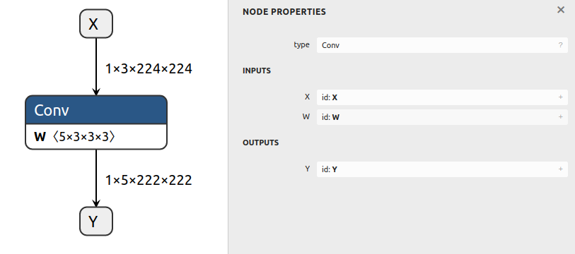

# 创建带有初始化器的 ONNX 模型

## 简介

此示例创建一个包含具有权重的单个卷积节点的 ONNX 模型。

在 ONNX GraphSurgeon 中，`Constant` 会自动导出为 ONNX 图中的初始化器。

## 运行示例

通过运行以下命令生成模型并保存为 `test_conv.onnx`：

```bash
python3 example.py
```

生成的模型如下所示：


