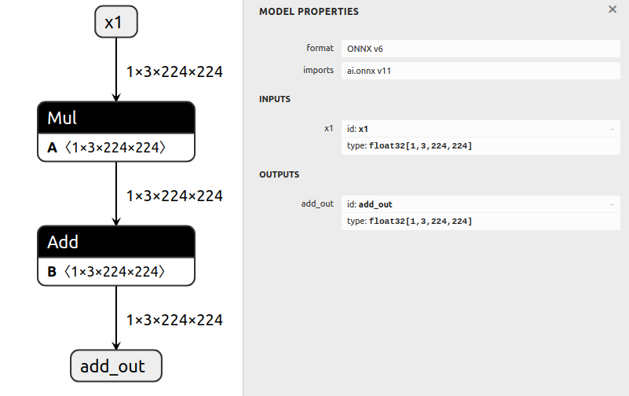

# 隔离子图

## 简介

此示例首先生成一个基本模型，然后从该模型中提取一个子图。

从模型中隔离一个子图就像修改图的输入和输出、运行 `graph.cleanup()`，然后重新导出图一样简单。

我们**不需要**知道我们想要的节点、初始化器或中间张量 - 标记输入和输出对于 ONNX GraphSurgeon 能够自动确定其他信息是足够的。

## 运行示例

1. 通过运行以下命令生成一个带有多个节点的模型并保存为 `model.onnx`：

   ```bash
   python3 generate.py
   ```

   生成的模型计算 `Y = x0 + (a * x1 + b)`：

   

2. 通过运行以下命令隔离计算 `(a * x1 + b)` 的子图并保存为 `subgraph.onnx`：

   ```bash
   python3 isolate.py
   ```

   生成的模型计算 `add_out = (a * x1 + b)`：

   
