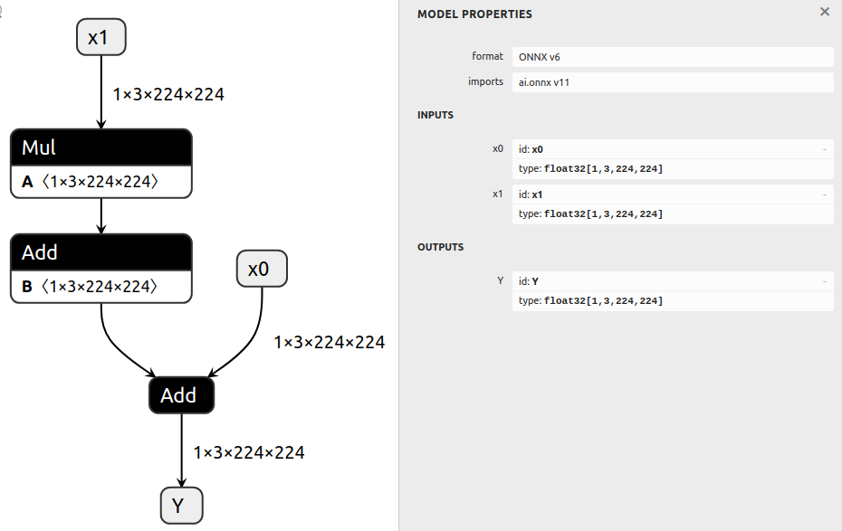

# 修改模型

## 简介

此示例首先生成一个基本模型，然后以各种方式修改生成的模型。

通过将 ONNX 图导入[ONNX GraphSurgeon IR](../../README.md#ir)，可以修改图的几乎每个方面。
然后，我们可以将修改后的 IR 导出回 ONNX。

## 运行示例

1. 通过运行以下命令生成一个带有多个节点的模型并保存为 `model.onnx`：

   ```bash
   python3 generate.py
   ```

   生成的模型计算 `Y = x0 + (a * x1 + b)`：

   

2. 通过运行以下命令以各种方式修改模型，并保存为 `modified.onnx`：

   ```bash
   python3 modify.py
   ```

   此脚本执行以下操作：

   - 删除第一个 `Add` 节点的 `b` 输入
   - 将第一个 `Add` 更改为 `LeakyRelu`
   - 在第一个 `Add` 后添加一个 `Identity` 节点
   - 更改图的输出为 `Identity` 节点的输出
   - 运行 `cleanup()`，由于先前对图输出的更改，删除了 `x0` 张量和第二个 `Add` 节点。

   最终的图计算 `identity_out = leaky_relu(a * x1)`：

   
