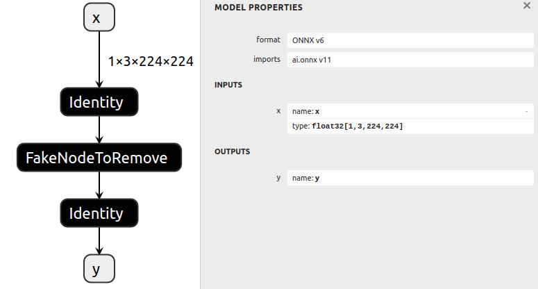
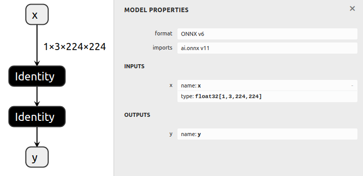

# 删除节点

## 简介

此示例首先生成一个基本模型，然后删除模型中间的一个节点，并重新连接图中的其余节点。

为了删除一个节点，我们将其输入节点的输出张量替换为其自己的输出，然后删除其与输出的连接。

## 节点删除基础知识

例如，对于具有以下结构的图：

     Node0
       |
    Tensor0
       |
     Node1
       |
    Tensor1
       |
     Node2
       |
    Tensor2

为了删除 `Node1`，

1. 将 `Node0` 的输出从 `[Tensor0]` 更改为 `[Tensor1]`。
2. 将 `Node1` 的输出从 `[Tensor1]` 更改为 `[]`。

生成的图如下所示：

     Node0
       |
    Tensor1       Tensor0
       |             |
     Node2         Node1
       |
    Tensor2

请注意，`Node1` 仍然存在于图中。通过运行 `cleanup()` 函数可以轻松解决这个问题。

## 运行示例

1. 通过运行以下命令生成一个带有多个节点的模型并保存为 `model.onnx`：

   ```bash
   python3 generate.py
   ```

   生成的模型包括一些恒等层和一个将被删除的虚假节点。

   

2. 通过运行以下命令删除虚假节点，并将其保存为 `removed.onnx`：

   ```bash
   python3 remove.py
   ```

   
