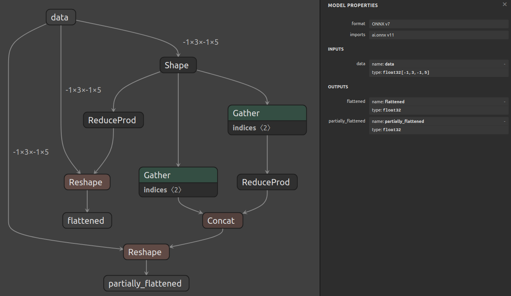

# 使用图层 API 进行形状操作

## 简介

此示例使用 [示例 07](../07_creating_a_model_with_the_layer_api/) 中概述的图层 API，创建一个在具有动态形状的输入上实现形状操作的模型。

具体来说，概述了两种常见情况：

1. 对包含动态维度的输入张量进行展平操作。涉及的层包括：
   - `Shape`：获取输入形状。
   - `ReduceProd`：计算输入形状的体积。
   - `Reshape`：将输入的形状更改为其体积。

2. 对包含动态维度的输入张量进行部分但不是全部维度的折叠操作。涉及的层包括：
   - `Shape`：获取输入形状。
   - `Gather`：获取输入形状的前两个维度。
   - `Gather`：获取输入形状的最后两个维度。
   - `ReduceProd`：计算最后两个维度的体积。
   - `Concat`：将原始形状的第一个维度与其他维度的体积组合。
   - `Reshape`：根据计算出的形状对输入进行重塑。

## 运行示例

1. 通过运行以下命令生成模型并将其保存为 `model.onnx`：

   ```bash
   python3 generate.py
   ```

   生成的模型如下所示：

   
