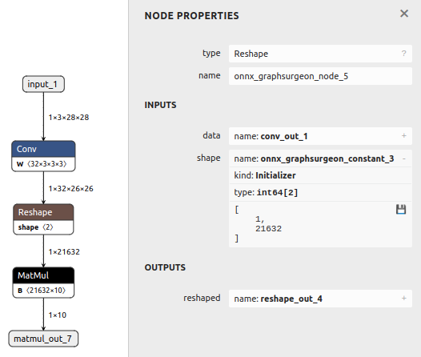
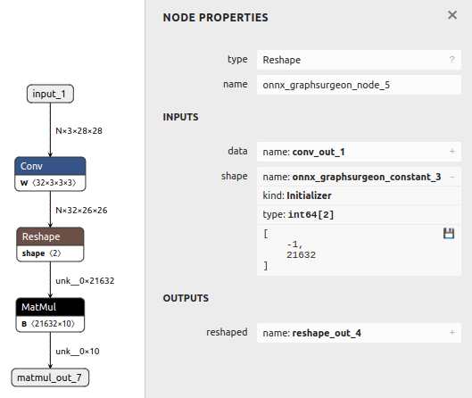

# 动态批处理大小

## 简介

此示例首先生成一个具有静态批处理大小的基本模型，然后修改结果模型以支持动态批处理大小。

## 基础：修改输入的批处理大小

以下是将静态ONNX模型转换为动态模型所需的主要代码：

```python
graph = gs.import_onnx(onnx_model)
for input in graph.inputs:
   input.shape[0] = 'N'
```

上述代码对于简单的模型应该足够了。
然而，某些模型可能还需要更新其内部层，例如静态的 `Reshape` 层。
请查看下面的示例，了解这种情况的示例。

## 运行示例

1. 通过运行以下命令生成具有静态输入形状和多个节点（包括静态 `Reshape`）的模型，并将其保存为 `model.onnx`：

   ```bash
   python3 generate.py
   ```

   

2. 通过运行以下命令将模型转换为支持动态批处理大小，并将其保存为 `modified.onnx`：

   ```bash
   python3 modify.py
   ```

   此脚本执行以下操作：

   - 更新输入的批处理大小为 `N`（动态符号）
   - 更新 `Reshape` 节点的形状（如果存在）为 `-1`（动态值）

   结果图现在支持任何批处理大小：

   
